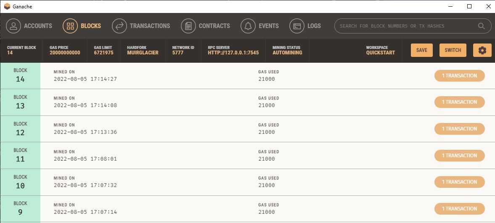
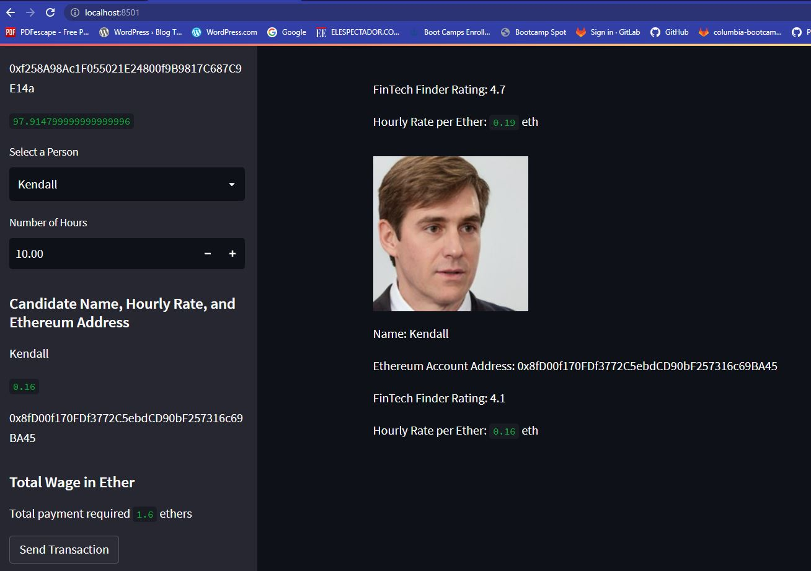
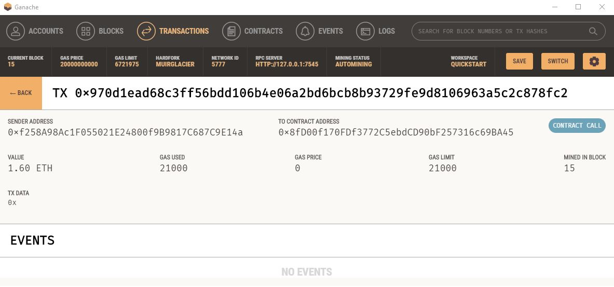

# Fintech Finder

Through Fintech Finder you can send payments to your favorite Fintech professionals through the Ethereum blockchain. 

1) Select the Fintech professional you want to send the payment to.

2) Enter the number of hours you want to pay.

3) Click on "Send Transaction."

4) You are all set. The transaction has been recorded in the Ethereum blockchain!

 

The Ganache blocks that the user creates through the app. 
  
   

 

In this example the user sends a payment to Kendall for 10 hours of work i.e. 1.6 eth.
 
 

 

Here we can see the transaction detail in Ganache.

